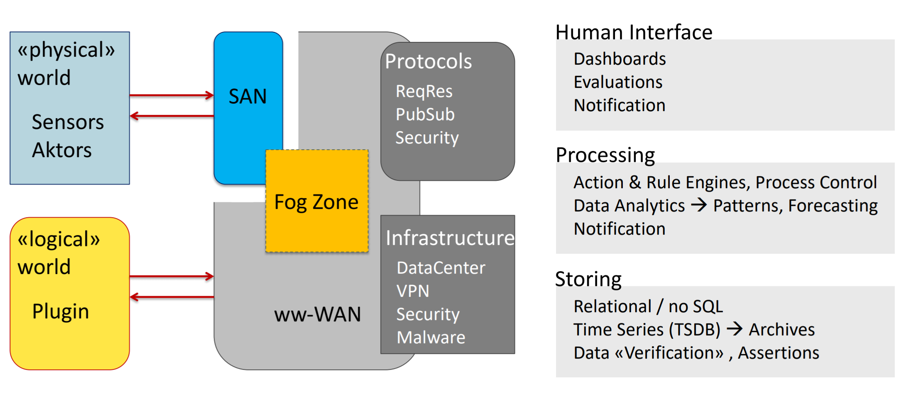
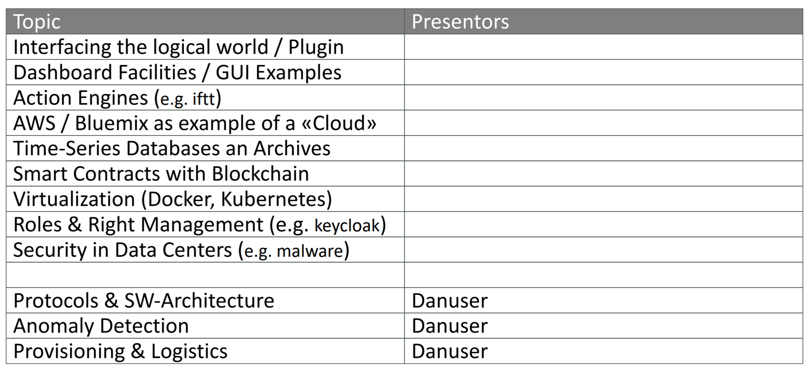

# Prüfung
Prüfung wird ein Teil von diesem Bild beschrieben, welchen ich wähle ein zweiter Teil wird von Danuser bestummen.

Eine Präsi wird gemacht über eines der Folgenden Themen:

Zuerst Ziel
Dann Methodik und als drittes Technik