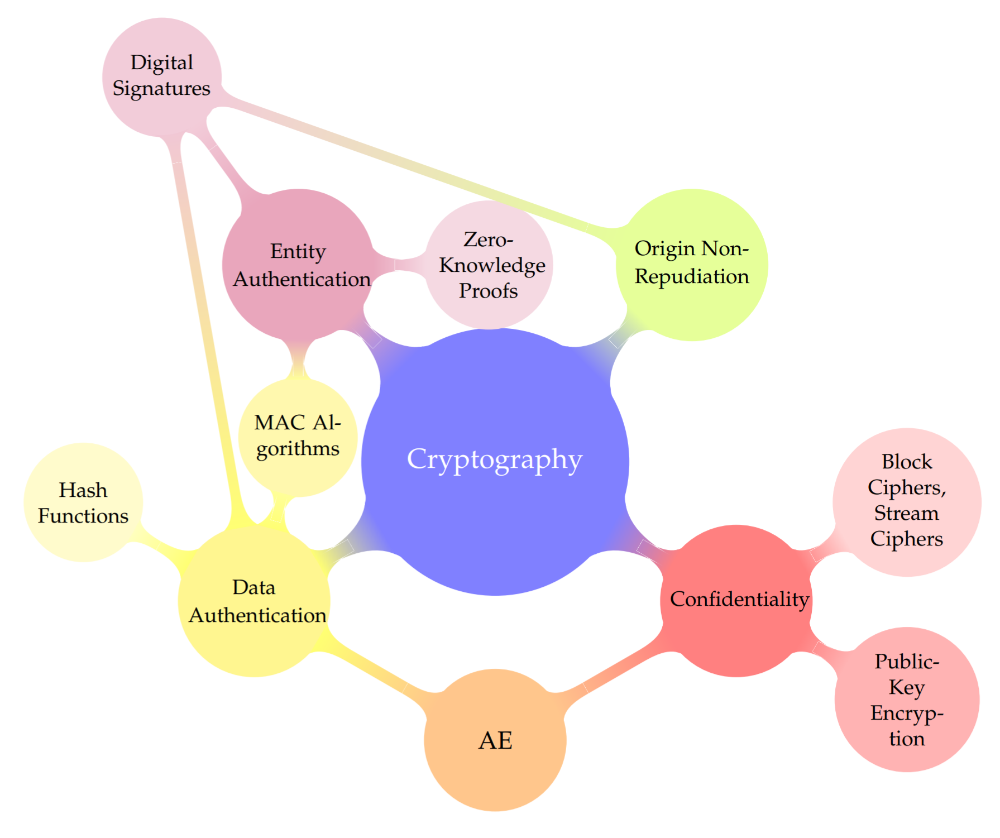
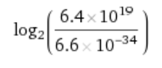
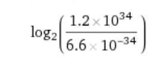
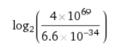
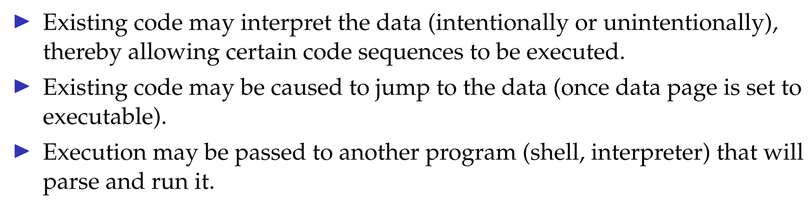
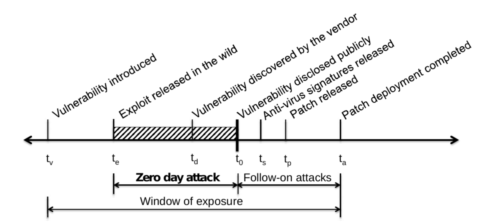
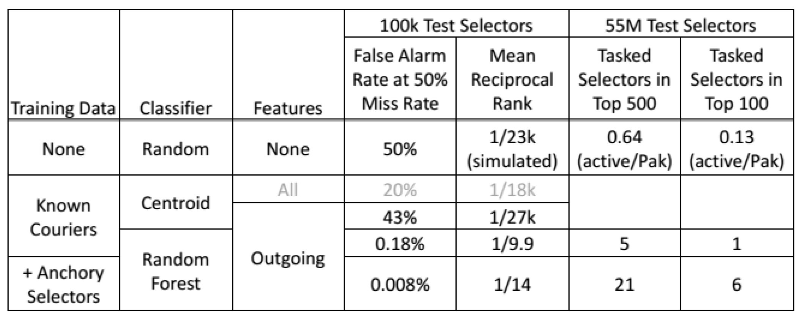
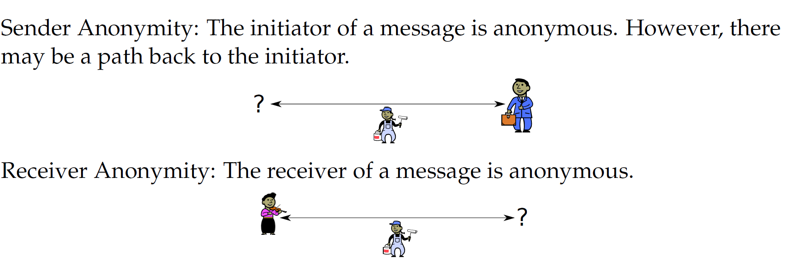
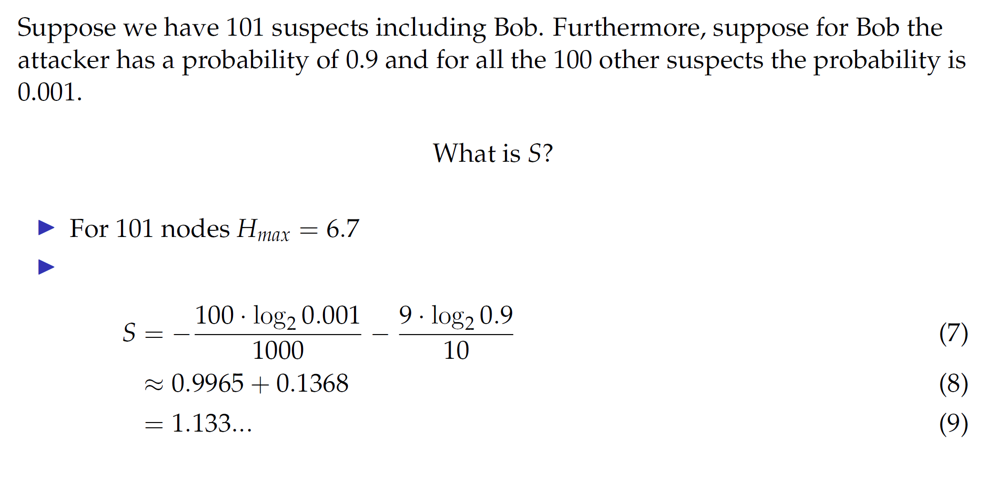

# Security und so

## Ethics

- Meta-ethics -> What is the nature of moral judgements
- Normative ethics -> How can we answer ethical questions systematically
- Applied ethics -> Provides answers to specific issues

Normative ehtics: Virtue ethics

- Utilitarianism holds that an action is right if it leads to the most happiness for the greatest number of people.
- Intellectualism dictates that the best action is the one that best fosters and promotes knowledge.
- Welfarism argues that the best action is the one that most increases economic well-being or welfare.
- Egoism is the belief that the moral person is the self-interested person: an action is right if it maximizes good for the self.


## Information security

Information has a monetary value. Therefore we speak of **information assets**

CIA
- **C**onfidentiality Vertraulichkeit
- **I**ntegrity Richtigkeit
- **A**vailability Verfügbarkeit
  
AAA
- **A**uthenticity Echtheit / Rechtsgültigkeit
- **A**ccountability Verantwortlichkeit
- **A**uditability Nachvollziehbarkeit
- Non-repudiation Nachweisbarkeit, Unleugbarkeit

### Risk

```
r = v * p
```
Risk is value (cost potential damage) multiplied by the probability of this damage occurring

### Vulnerability

Inability of a system to withstand the effects of a hostile environment.

### Threat

Possible danger that might exploit a vulnerability.

### Attack

Attempt to expose, alter, disable, destroy, steal or gain unauthorized access to or make unauthorized use of an information asset.

### Exploit

Action that takes advantage of a vulnerability.

### Incident

Event that could lead to loss of control over an information asset.



### Keys

Keys are short information assets used for certain cryptographic operations.

### Kerckhoffs’ principle

A cryptosystem should be secure even if everything about the system, except the key, is public knowledge.

### Brute-force

A brute-force attack involves trying all the keys (until the one that works is found).

### Entropy

Entropy describes the information content of a key or message.

A key with 128 bits of entropy requires 2128 brute-force attempts.

Beispiel: 

minimum h = 6.626 * 10^-34 J(s)

1. Global annual electircity consumption: 6.4 * 10^19 J

 = 176

2. Total energy output of the Sun per Year: 1.2 * 10^34 J

 = 223

3. Estimated total mass energy of observalbe universe: 4 * 10^69 J

 = 341


## Attacker

### Origings

- Insider
- Ex-insider (“disgruntled former employee”)
- Competitor
- Hacktivist
- Criminal
- State actor
- Researcher

### Objectives

- Stealing information (business secrets, credentials)
- Modifying information (e.g. bank transactions)
- Abusing infected systems (e.g. spamming)
- Attacking other systems (origin obfuscation)
- Hiding (avoid detection, achieve long-term persistence)
- Conteact command and control (C2) for instructions

### Vulnerability Origins

- Hardware (host, network)
- Software (host, network)
- Humans
- Environment

### Atk Strategies

- Large scale attack: attack a large, untargeted population. Even if the success rate is low, the absolute number of infections and the resulting revenue can be high. (“cyber crime”)

Zum beispiel Massenmails Spam, nigeranischer Prinz mail
- I Targeted attack: attack a few, selected users or their machines. Select high-value target first, then learn about it as much as possible for a precision strike (“Advanced persistent threat”)

Eher schwierig sich zu schützen, da nicht bemerkbar und gezielter

### Def Strategies

- Access control (physical, logical)
- Deterrance (legal, counter-attacks, auditing, accounting)
- Redundancy
- Obfuscation
- Comprehension (simplification, transparency, education)
- Monkey wrench / havoc
- Defense-in-depth


## Vulnerabilites

- Software vulnerabilities
- Technical vulnerabilities

### Typical Bugs

- user downloads files
- User selects software to open file
- Software parses file
- Bug => malicious code exec.

Common bugs include problems in the parsing or erenderling logic, or scripting func supported by the doc format in combination with an interpreter that is insufficiently sandboxed

### Data and code



### Vulnerability timeline



## Skynet

### Cloud Anayltic Building Blocks

- Travel Patterns
- Behavior-Based Analytics
- Other Enrichments
  - Travel on particular days of the week
  - Co-travelers
  - Similar travel patterns
  - Common contacts
  - ...

From GSM metadata we can measure aspects of each selector's pattern of life...

Statistical algorithms are able to find the couries at very low false alarm rates.

### Random Forest Classifier




### Anonymity

A user’s action is anonymous if the adversary cannot link the action to the user’s identity.

### The user's identity

- real name
- fingerprint
- passport number
- ip adress
- MAC adress
- login name
- ...



### Entropy



### Onion Routing

//TODO


### Tor - How it Works