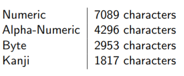
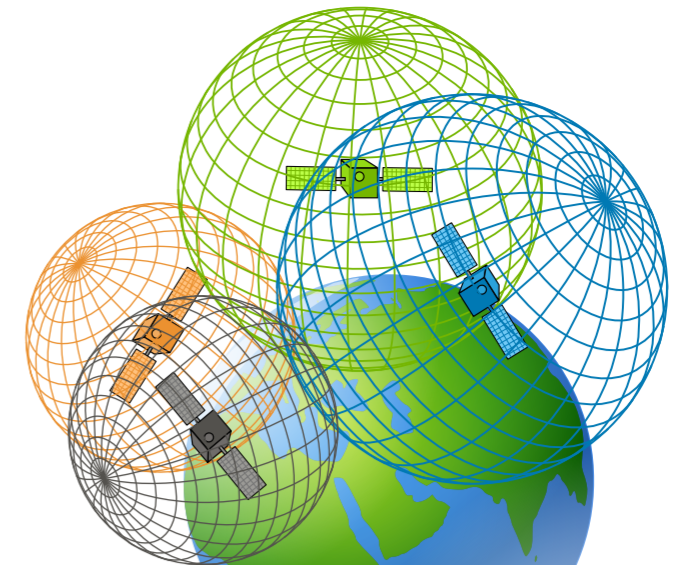
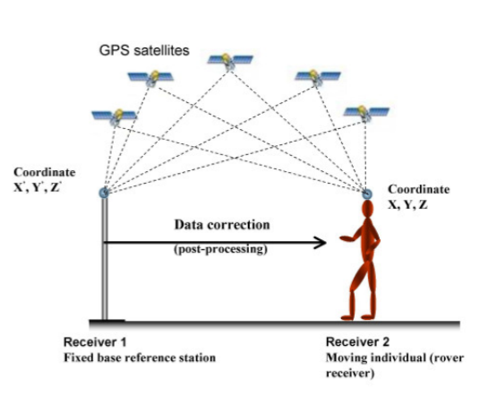
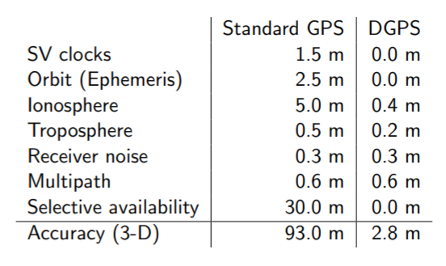
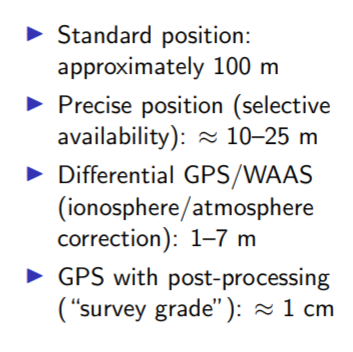

# QR-Codes

Redundanzstufen, 7-30%

- Numeric
- Alpha-Numberic
- Byte
- Kanji
- Extended channel interpretation
- Structured
- FNC1

A 40-l QR code (177*177 7%EC)



## Create QR Code:
```C
#include <qrencode.h>
QRinput * qri;
QRcode *qrc;

qri = QRinput_new2 (0, QR_ECLEVEL_M);
QRinput_append (qri, QR_MODE_AN, strlen (text), (unsigned char*) text);
qrc = QRcode_encodeInput (qri);
```

### Create Pixel Buffer

```C
#include <gdk-pixbuf/gdk-pixbuf.h>
unsigned int size = qrc->width * scale;
size += 8 - (size % 8);
GdkPixbuf *pb = gdk_pixbuf_new (...);
guchar *pixels = gdk_pixbuf_get_pixels (pb);
int n_channels = gdk_pixbuf_get_n_channels (pb);
```

```C
for (unsigned int x=0;x<size;x++)
for (unsigned int y=0;y<size;y++) {
off = (x * qrc->width / size) + (y * qrc->width / size) * qrc->width;
  for (int c = 0; c < n_channels; c++)
    pixels[(y * size + x) * n_channels + c] = (0 == (qrc->data[off] & 1)) ? 0xFF : 0;
}
```


# GPS

"GPS time" for clock-correction 

GPS -> UTC - Korrekturprobleme

## Data transmitted

- Coded ranging signals for trilateration ( to determine travel time of radio singal)
- Clock information (GPS Time) and clock correction information (conversion to UTC)
- Ephmeeric position information (where the satellite is)
- Almanach on GPS constellation including location and health (von allen)
- Atmospheric data

Zeit differenz zwischen geschickt und bkeommen gibt idee über Distanz. 

Almanac Kann lange dauern, daher auch oft von internetz.

## Basic Steps

- Ranging: Determine distance from SV
- Timing: obtain very precise current time
- Pos: Determine pos of SV in space
- Trilateriation: interesection of spheres
- Corection of errors

## Accurate Timing

- SV has highli accurate atomic clocks
- Receicer has way less accurate clock
- 10 ms = 3000 km error
- Resolve discrepnacy clocks using fourth satellite (solve for four variables: X, Y, Z and T)

Minimum 3 Staeliten, da höhe jenachdem weg gelassen werden kann.

### Trilateriation


  
## Receiver start-up
- Acquire one staellite to get time and almanmach
- Acquire 2 other satellites to get 2-D pos
- Acquire 4th sat to get 3-D pos
- Acquire any other visible satellite to improve accuracy

## Sources of inaccuracy

- Atmospheric delay
- Multi-path error (reflection from buildings etc)
- Obstruction (blocked by buildings)

## DGPS

As a service (paid for)



### Genaugkeit

Pro dimension





## Applications

- Military
- search and rescue
- suverying
- navigaion
- Geographic informations ystem

## Location using phones

- GPS, Cell-ID, Wifi
  - Cell of irign
  - time of arrival
  - angle of arrival
  - signal strength
  - video data
- User movement
- Varying accuracy
- Varying cost (energy)