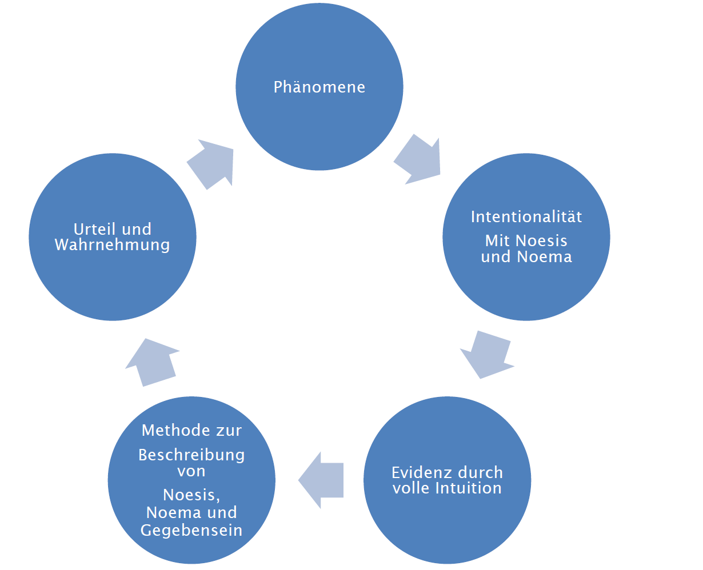

# Phänomenologie

## Methoden

- Historisch einklammung
  - übernommene Konzepte
  - übernommene Theorien
  - Glaubensgunrdsätze
- Existenzielle Einklammerung
- Eidetische Variation
  - Determinierung der essentiellen Eigenschaften
  - Wegnehmen bis nicht mehr Katze
- Transzendentale Fokussierung
  - Akte und Strukturen werden untersucht

## Wahrnehmung

Beispiel Quader, immer nur Teile sichtbar, einige Seitenflächen des Quaders

Intution des Quaders, gegenwärtigen des intendierten statt es in der Abwesenheit zur intendieren was eine leer Intuition ist. In der Erinnerung gibt es keine bildliche Repräsentation, sondern nur Wider-Erelbnisse

Disquotation -> selber erleben

| Phänomenologie| Alltagsbeschreibung   |
| ------------- |-----------------------| 
| Wahrnehmungsorientiert | Gefühle, Wertend | 
| Ich-bezogen | Historisch bedingt |
| Sachlich, Klarer, Genauer | |
| "Ich beschreibe die Erfahrung" | |
| Nur Selbsterfahrung | |
|